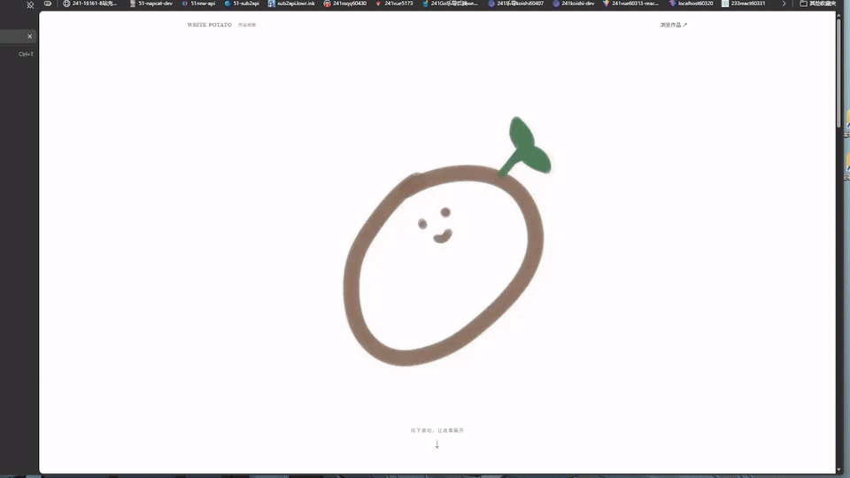

# 🥔 WHITE POTATO · 作品集

[⬅️ 返回仓库首页](../README.md) · Vue 3 + TypeScript + Vite + GSAP

## 🎞️ 作品收录

| 分组 | 数量 | 展示方式 |
|---|---:|---|
| 精选作品 | 18 部 | 每行一部，封面与标题左右交错；手机端上下排列 |
| 更多作品 | 31 部 | 默认折叠，展开后桌面三列、平板两列、手机单列 |
| **合计** | **49 部** | 点击封面播放，上一部/下一部在当前分组内循环 |

更多作品保留封面尺寸与标题字号，压紧留白；1440px 桌面下每行约占 300px 高度。

## ✨ 页面交互

| 区域 | 效果 |
|---|---|
| 首屏 | 大土豆随滚动缩小上移，标题依次出现，反向滚动可逆 |
| 固定导航 | 回到顶部、跳转底部、GitHub 仓库入口 |
| 自动滚动 | 1 秒 easeInOutCubic，可被滚轮、触摸和键盘操作打断 |
| 展开/收起 | 0.6 秒曲线高度与淡入淡出；展开后定位内容，收起前滚回按钮 |
| 页脚封面 | 点击播放一次约 19.13 秒的 GIF，前后用 0.3 秒白色渐变衔接，结束恢复图片 |

支持系统「减少动态效果」；`?snap` 可查看滚动场景的静态终态。播放器支持 Escape 关闭，关闭后焦点返回卡片。

## 🎬 首屏效果演示

## 🛠️ 本地开发

在 `web/` 目录运行：

| 命令 | 用途 |
|---|---|
| `npm ci` | 安装依赖 |
| `npm run dev` | 热重载开发：http://localhost:60606/ |
| `npm run build` | 类型检查并构建 `dist/` |
| `npm run preview` | 预览构建结果，需先停止同端口 dev 服务 |

## 🚀 更新 GitHub Pages

只部署 `main`，普通 push 不发布。支持以下两种方式：

| 方式 | 操作 |
|---|---|
| CLI 手动触发 | `gh workflow run pages.yml --ref main` |
| 提交标记 | 最新提交信息包含 `[update-page]` 或 `[updatepage]` |

标记大小写不敏感，必须带方括号、不含空格；只检查一次 push 的最后一条提交，包括正文。

提交示例：`feat(web): 更新作品集 [update-page]`。提交标题和正文使用简体中文，类型/scope 与 `Co-authored-by` 标准 trailer 除外。

使用 `gh run list --workflow pages.yml` 查看运行记录，`gh run watch <run-id> --exit-status` 等待完成。工作流构建并部署 `web/dist`。

## 🎨 数据与资源

| 内容 | 来源 |
|---|---|
| 精选清单 | `src/data/videos.json` → Release「精选18个视频」 |
| 更多作品清单 | `src/data/more-videos.json` → Release `more-videos` |
| 封面 | `public/assets/covers/` |
| 中文标题 | 得意黑 Smiley Sans；精选最大 42px、手机 28px，更多作品 20px、手机 18px，播放器 18px；搭配语义 emoji |
| 品牌 | Computer Modern |
| AV 编号与时长 | Tinos／思源宋体；精选 18px，更多作品及播放器 16px |
| 正文与界面 | Tinos、Noto Serif SC、Noto Sans SC |

修改清单时同步 `public/assets/` 下的 JSON 副本。视频存放在 Release，字体随网页自托管；字体授权见各 npm 包。

资产名使用 `av号码.mp4`；未知编号的小黑视频使用 `av-unknown-xiaohei.mp4`，`av: null`。新资产先在草稿 Release 校验名称、大小及 SHA-256，发布后再更新网页。

本地维护脚本 `07-import-more.mjs`、`08-upload-more.mjs` 位于被 Git 忽略的 `temp/scripts/`，从 `web/` 目录运行；暂存目录为 `G:\tmp\codex\White_Potato_Album`。
